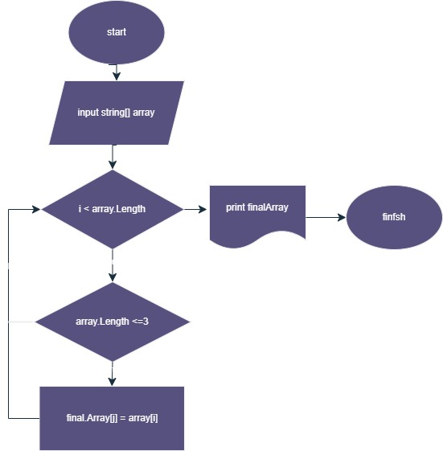

*Принцип работы программы*
1. Принимаем через ввод с клавиатуры значения массива;

2. Проверяем каждый его элемент на длину. Если он меньше или равен 3 символам, записываем его в новый массив;

3. Выводим старый и новый массив;

4. Графическое представление алгоритма решения задачи. Блок схема

